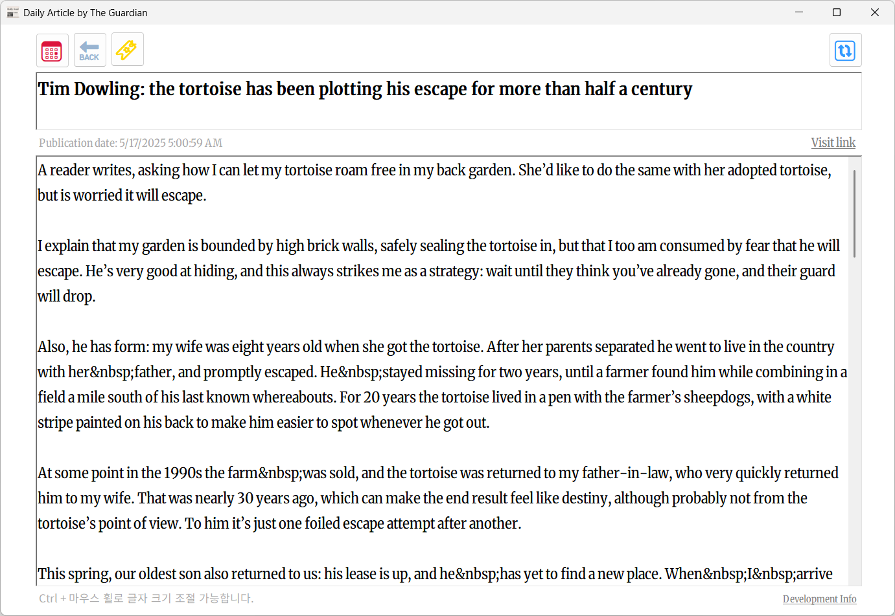

# 📰 Daily Article
> The Guardian API를 사용하여 영어 신문을 제공하는 심플한 데스크톱 어플리케이션입니다.



<br>

**[⬇ 실행 파일 다운로드](https://github.com/tony96kimsh/DailyArticle/releases/download/1.0.0/Release.zip)**  
(압축 해제 후 `.exe` 파일을 실행해주세요)

---

## 프로젝트 개요

### 제작 배경

영어 신문은 영어 공부에 활용하기 좋은 자료입니다.  
웹사이트에서 신문을 읽을 때는 광고나 불필요한 UI가 학습에 방해가 되기 쉬운데,  
단순하고 광고 없는 환경에서 핵심 뉴스 기사만 제공되면 더 효율적인 학습이 가능하다고 판단했습니다.  
WinForms를 활용한 데스크톱 앱 형태로 영어 뉴스 리더를 개발하였습니다.

### 기술 스택

- 언어: C#
- 플랫폼: WinForms (.NET Framework)
- 외부 라이브러리: Newtonsoft.Json
- API: [The Guardian Open API](https://open-platform.theguardian.com/)

### 주요 기능

- 매일 가장 중요한 영어 뉴스를 자동으로 제공
- 기사 제목, 본문, 발행일 표시
- HTML 태그 제거로 깔끔한 기사 출력
- 기사 원문 링크 열기
- 로딩 중 딤 처리 및 "Loading..." 표시
- API 키 외부 파일에서 설정 (App.config)

---

## 프로젝트 구조

### 레이아웃 구성

- `txtTitle`: 뉴스 제목 표시
- `txtAriticle`: 본문 표시용 RichTextBox (읽기 전용, 포커스 캐럿 제거)
- `lblDate`: 발행일 표시
- `linkLabel1`: Guardian 기사 원문 열기
- `llbDev`: GitHub 프로젝트 열기
- `btnChange`: 기사 갱신 버튼
- `overlay(Form)`: "Loading..." 표시용 반투명 폼 (TopMost)

### 폴더 구조

```
DailyArticle/
├── img/                  # 스크린샷 이미지 폴더
├── bin/                  # 빌드 실행 파일 위치
├── App.config            # API 키 설정
├── Form1.cs              # 메인 폼 로직
├── Program.cs            # 진입점
└── README.md             # 리드미 파일
```

### 코드 구조 요약

- `Form1.cs`
  - `InitOverlay()`: 오버레이 폼 초기화
  - `showArticle()`: Guardian API 요청 및 기사 표시
  - `ParseHTML()`: HTML 제거 후 본문 정리
  - `showLoading()`: 오버레이 토글 제어
- `App.config`: API 키를 외부에서 분리하여 관리

---

## 추후 작업 및 이슈

### TODO

- 날짜 선택 캘린더 기능 추가
- 기사 즐겨찾기 기능 구현
- 기사 히스토리 열람 기능

### Issues

- Merriweather 폰트 미설치 시 폰트 대체 문제
- 다중 모니터 환경에서 오버레이 위치 이슈 발생 가능성

---

## 참고자료

- Merriweather 폰트  
- The Guardian Open API  
- [Microsoft Docs - WinForms](https://learn.microsoft.com/en-us/dotnet/desktop/winforms/)  
